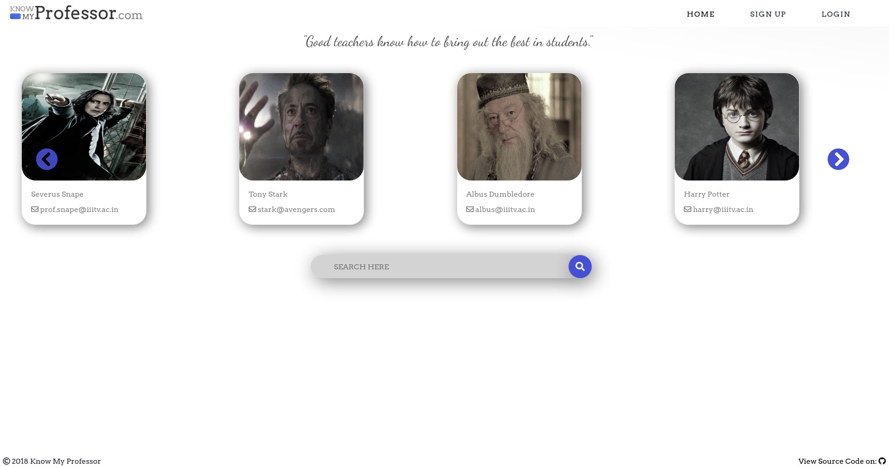
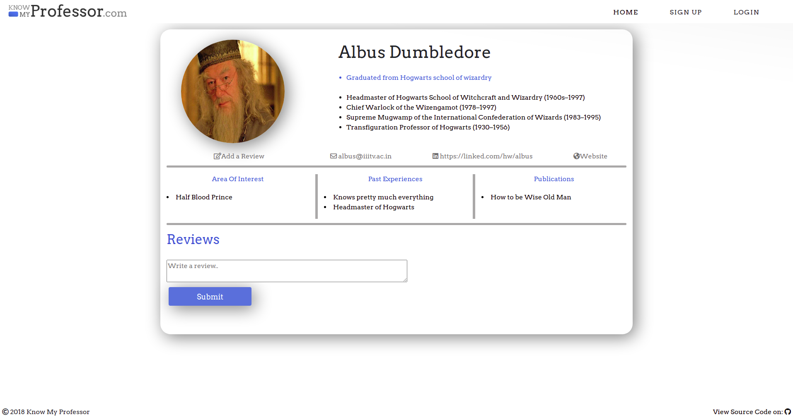

# Know My Professor
IT-202(Intro to INFORMATION TECHNOLOGY) Project

<kbd></kbd>

### About

This website shows the details of all the professors in the institute. Students can write reviews about the professors too.

<kbd></kbd>

We are using LAMP stack for this project.
### Prerequisites

You need to install following IT tools :
```
PHP
Apache2
MySQL
phpMyAdmin
```
### Installing(UBUNTU)

Follow the steps to setup the project on your system-

  1. Open phpMyAdmin and create a user with username 'itbois' and password 'Password@123'

  2. Setup Postfix on your system [Click Here](https://opensourceinside.blogspot.com/2016/09/how-to-install-and-configure-postfix-to.html) for help

  3. Open Terminal and Clone the Repository
  ```
  cd dir_name(Apache localhost Directory)
  git clone https://github.com/VAR-solutions/knowmyprof.git
  ```
  4. Open your browser and Goto below mentioned link to install Database:
  ```
  localhost/knowmyprof/install.php
  ```
  
#### For Users
  * Open your Browser and goto following address-
  ```
  localhost/knowmyprof
  ```
  * Click on Signup to create your Account
    1. Fill the Required Details
    2. Enter the Verification Code received on your E-Mail (check Spams)
  * Already Registered? Click on Login
    1. Fill Roll Number and Password to login
    2. Forgot Password? Click on Forgot Password and Enter the Verification Code and then Change Password
  * Search Your Professor.
  * Click on Professor Card to see details.
  * Give Review to your Professor (Login Required).

#### For Admin site
  * Open your Browser and goto following address-
  ```
  localhost/knowmyprof/admin
  ```
  * Enter following the credentials-
  ```
  username:12345
  password:qwerty
  ```
  * Click on Add Professor to add a new professor
  * Click on Professor List to see all professors
    * Select a professor to see all details
    * Click on Edit to update details
    * Choose New Image
    * Click on Save.
  * Click on Users to see list of Registerd Users
  * Click on Reviews to see all reviews
  * Click on View Site to see LIVE Demonstration

### Built With-
* PHP (Scripting Language)
* HTML
* CSS (Style Sheets)
* JavaScript
* MySQL (Database)
* Apache (Web Server)

